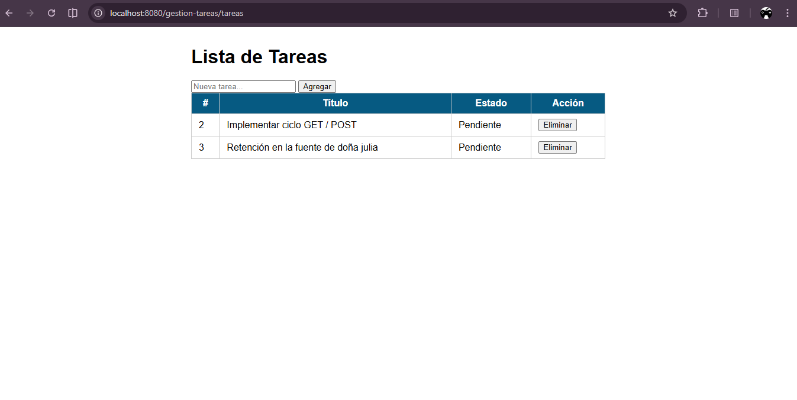

# PostConte-1-U5

Instrucciones para compilar y ejecutar la aplicación web de ejemplo.

## Requisitos
- Java JDK 8 o superior
- Apache Maven
- Apache Tomcat 9+ (u otro contenedor de servlets compatible)

## Compilar

Desde la raíz del proyecto, ejecutar:

```
mvn clean package
```

El artefacto WAR se generará en la carpeta `target/` (por ejemplo `target/*.war`).

## Desplegar en Tomcat

1. Copia el archivo WAR generado a la carpeta `TOMCAT_HOME/webapps`.
   - En Windows, por ejemplo: copia `target\\mi-app.war` a `C:\\apache-tomcat-9.0.\\webapps`
2. Arranca (o reinicia) Tomcat.
3. Abre en el navegador: `http://localhost:8080/<nombre-del-war>/` (reemplaza `<nombre-del-war>` por el nombre del WAR desplegado).

## Ejecutar desde un IDE

Importa el proyecto como proyecto Maven (IntelliJ IDEA, Eclipse). Configura un servidor Tomcat en el IDE y despliega el artefacto.

## Ejecutar con Jetty (opcional)

Si prefieres ejecutar con Jetty y tienes el plugin configurado, prueba:

```
mvn org.eclipse.jetty:jetty-maven-plugin:run
```

## Captura de pantalla

La siguiente imagen muestra la aplicación funcionando:

